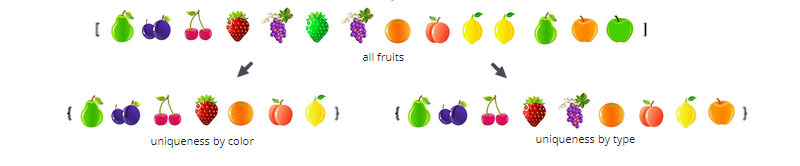

# Typescript Extended Set


## About
[](https://hadasbro.github.io/typescript-super-set/)
[
[](https://travis-ci.org/hadasbro/typescript-super-set)
[](https://coveralls.io/github/hadasbro/typescript-super-set?branch=master)
[](https://github.com/semantic-release/semantic-release) 
[](https://github.com/prettier/prettier)


### What is this?

Project is an implementation of Set with custom comparator in Typescript. 




### How to install it?

    npm i typescript-super-set
or

    yarn add typescript-super-set


### How it works?
This is extended, generic implementation of `Set` (data structure with **unique elements**) with custom elements` comparator used for element's sorting and differentiating.


### What problem does it resolve?
Original **[JS Set](https://developer.mozilla.org/en-US/docs/Web/JavaScript/Reference/Global_Objects/Set)** does not 
provide a possibility to declare custom objects' comparator so in case of non-primitive types functionality of Set is very limited
(objects are considered as equal if their reference is the same).

From https://developer.mozilla.org/

    The Set object lets you store unique values of any type, whether primitive values or object references.

[JS Set](https://developer.mozilla.org/en-US/docs/Web/JavaScript/Reference/Global_Objects/Set) Examples:
- Primitive types 
    ```ts
    // Set has 3 elements whic is correct 
    let mySet = Set<Element>([1, 1, 2, 3]);
    ```
- Non primitive types 
    ```ts
    let el1: Element = {name: 'a', id: 1}
    let el2: Element = {name: 'a', id: 1}
    
    // Set has 2 elements and it is impossible to change this 
    // behaviour and consider both objects as identical

    let mySet = Set<Element>([el1, el2]); 

    ```
  
  
### What are possibilities?

#### Basic Sets
| Type  | Class | Order | Uniqueness by |
| ------------- | ------------- |------------- |------------- |
| Simple Set - _basic Set with unique elements_  | `SimpleSet<T>`  | Insertion order  | Comparator's result  |
| Sorted Set - _set with unique elements and declared order (ASC/DESC in comparator context)_ | `SortedSet<T>`  | Comparator's result and declared order direction (ASC / DESC)  | Comparator's result  |
| Hash Set - _set with unique elements where uniqueness means different result of hashCode() method_ | `HashSet<T,S>`  | Insertion order | result of `Hashable.hashCode()` method  | 
| Sorted Hash Set - _version of Hash Set with elements sorted in declared order_ | `SortedHashSet<T,S>`  | `Hashable.hashCode()` value and declared order direction (ASC / DESC)  | result of `Hashable.hashCode()` method  |

#### Extended implementations

##### Implementations with Observer Pattern
Sets implementing [Observer Patters](https://en.wikipedia.org/wiki/Observer_pattern) to ensure that any mutation on any element 
in the Set will be taken into consideration and Set may be refreshed in case if its needed. See [Edge cases - objects mutability](#edge-cases)
Extended Sets have suffix `Obs`, e.g. `SortedSetObs`, `SimpleSetObs` etc.

| Type  | Class | Order | Uniqueness by | Additional info |
| ------------- | ------------- |------------- |------------- |------------- |
| Simple Set _with Observer_ | `SimpleSetObs<T>`  | see `SimpleSet<T>`   | see`SimpleSet<T>`   | **[Experimental]** Allows only elements implementing `Observable`  |
| Sorted Set _with Observer_ | `SortedSetObs<T>`  | see `SortedSet<T>`   | see `SortedSet<T>`  | as above  |
| Hash Set _with Observer_ | `HashSetObs<T,S>`  | see `HashSet<T>` | see `HashSet<T>`  | as above  |
| Sorted Hash _with Observer_ | `SortedHashSetObs<T,S>`  | see `SortedHashSet<T>`  |  see `SortedHashSet<T>`  | as above  |

## Examples

#### Considering below sample elements

```typescript
interface Elem {
    id: number,
    name: string
}

let elem1: Elem = {
    id: 2, 
    name: 'elem1'
}

let elem1Copy: Elem = {
    id: 2, 
    name: 'elem1Copy'
}

let elem2: Elem = {
    id: 1, 
    name: 'elem2'
}

/* comparator compares elements by ID, for greater object.id returns 1, for lower -1, for equal 0*/
let comparator = (el1: Elem, el2: Elem) => el1.id === el2.id ? 0 : (el1.id > el2.id ? 1 : -1);

/* comparator by name */
let nameComparator = (el1: Elem, el2: Elem) => el1.id === el2.id ? 0 : (el1.id > el2.id ? 1 : -1);

class HashableElem implements Hashable<string> {

    public name: string;
    public type: string;
    
    /* uniqueness by type */
    hashCode(): string {
        return this.type;
    };

    constructor(name: string, type: string) {
        this.name = name;
        this.type = type;
    }
}

let elem4 = new HashableElem('Name1', 'type-a');
let elem5 = new HashableElem('Name2', 'type-b');
let elem6 = new HashableElem('Name3', 'type-a'); // again type = type-a
let elem7 = new HashableElem('Name4', 'type-b'); // again type = type-b

```

### Simple Set `(SimpleSet<T>)` and Sorted Set `(SortedSet<T>)`

```typescript
new SimpleSet<Element>(comparator, elem2, elem1, elem1Copy); 
// [{"name":"elem2","id":1},{"name":"elem1","id":2}]


new SortedSet<Element>(comparator, ORDER.DESC, elem2, elem1, elem1Copy); 
// [{"name":"elem1","id":2},{"name":"elem2","id":1}]


new SortedSet<Element>(comparator, ORDER.ASC, elem2, elem1, elem1Copy); 
// [{"name":"elem2","id":1},{"name":"elem1","id":2}]
```

### Hash Set `(HashSet<T>)` and Sorted Hash Set `(SortedHashSet<T>)`
```typescript
new HashSet<HashableElem, string>(elem4, elem5, elem6, elem7);
// [{"name":"Name1","type":"type-a"},{"name":"Name2","type":"type-b"}]


new SortedHashSet<HashableElem, string>(ORDER.DESC, elem4, elem5, elem6, elem7);
// [{"name":"Name2","type":"type-b"},{"name":"Name1","type":"type-a"}]


new SortedHashSet<HashableElem, string>(ORDER.ASC, elem4, elem5, elem6, elem7);
// [{"name":"Name1","type":"type-a"},{"name":"Name2","type":"type-b"}]
```


### Operations on sorted sets (`SortedSet<T>` and `SortedHashSet<T>`)
```typescript
let mySet = new SortedHashSet<HashableElem, string>(ORDER.DESC, elem4, elem5, elem6, elem7);
// [{"name":"Name2","type":"type-b"},{"name":"Name1","type":"type-a"}]

mySet.setSort(ORDER.ASC);
// [{"name":"Name1","type":"type-a"},{"name":"Name2","type":"type-b"}]

mySet.reverseOrder();
// [{"name":"Name2","type":"type-b"},{"name":"Name1","type":"type-a"}]
```


### Other operations - applicable for all kind of Sets

```typescript
// ---- instantiating Set with elements directly passed to constructor ---- //

new SimpleSet<Element>(comparator, elem2, elem1, elem1Copy); 
// [{"name":"elem2","id":1},{"name":"elem1","id":2}]


// ---- instantiating set and then do some operations on elements ---- //

(new SimpleSet<Element>(comparator)).add(elem2, elem1, elem1Copy); 
// [{"name":"elem2","id":1},{"name":"elem1","id":2}]


// ---- operations on elements ---- //

let mySet = new SimpleSet<Element>(comparator);

mySet.add(elem2); 
// [{"name":"elem2","id":1}]

mySet.clear(); 
// []

mySet.add(elem2); 
// [{"name":"elem2","id":1}]

mySet.delete(elem2); 
// []

mySet.add(elem2); 
// [{"name":"elem1","id":2}]

mySet.has(elem2);
// true

mySet.hasAll(elem2, elem1, elem1Copy);
// false

mySet.hasNot(elem1);
// true

mySet.size();
// 1

mySet.refresh();
// refresh set considering reference types

```

## Interfaces

#### All kind of sets

```typescript
interface SetBase<T> {
  /**
   * add
   *
   * Add new, unique element
   * (use comparator for checking elements equality)
   *
   * @param element
   */
  add(...element: T[]): this;

  /**
   * delete
   *
   * Delete element or many of them
   * (use comparator for checking elements equality)
   *
   * @param element
   */
  delete(...element: T[]): this;

  /**
   * clear
   *
   * Clear set, remove all elements
   */
  clear(): this;

  /**
   * has
   *
   * Check if the set contains an element
   * (use comparator for checking elements equality)
   *
   * @param element
   */
  has(element: T): boolean;

  /**
   * hasAll
   *
   * @param element
   */
  hasAll(...element: T[]): boolean;

  /**
   * hasNot
   *
   * @param element
   */
  hasNot(element: T): boolean;

  /**
   * size
   *
   * Get set's size (number of elements)
   */
  size(): number;

  /**
   * refresh
   *
   * Refresh set to make sure that set contains unique elements in correct
   * order (in case of mutable objects and any kind of changes on them)
   */
   refresh(): void;

}

```

#### Sorted Sets (`SortedSet<T>` and `SortedHashSet<T>`)

```typescript
interface SortedSet<T> {

  /**
   * setSort
   *
   * @param sort
   */
  setSort(sort: ORDER): void;

  /**
   * reverseOrder
   */
  reverseOrder(): void;
}

```

## Edge cases - object mutability

The standard implementation of Set, neither this one (`SimpleSet<T>`, `SortedSet<T>`, `HashSet<T>`, `SortedHashSet<T>`), neither in many other 
programming languages do not support scenario when elements are mutable and any key-property can be changed after adding to Set. 

For example, if we add unique (non-primitive / reference kind of) elements to the Set (e.g. considering element's name as a factor of uniqueness) 
and then, if we change the name of this object (to be the same in 2 elements) - we may break uniqueness and also our Set may no longer be fully correct.

Lets consider below example:

```typescript
let mySet = new SortedSet<Elem>(comparator, ORDER.ASC, el2, el1);

// here we have order by ID ASC
expect(mySet.toString()).toEqual('[{"name":"el2","id":1},{"name":"el1","id":2}]');

// now lets swap object's IDs (so in ideal world Set should see this and order of elements should change)
el2.id = 2;
el1.id = 1;

mySet.toString(); // [{"name":"el2","id":2},{"name":"el1","id":1}]

/* now - unfortunately order is not correct. The reason for that is that Set doesn't see changes on elements el1 and el2
but both those elements have been passed to the Set by reference, so now we have incorrect order (ideally - the order should be updated) */
```

That is why apart from standard sets implementation(`SimpleSet<T>`, `SortedSet<T>`, `HashSet<T>`, `SortedHashSet<T>`), this library 
also provides an extended - **EXPERIMENTAL** version of each standard Set which can be used 
to cover the above scenario.


#### Observable Sets (`SimpleSetObs<T>`, `SortedSetObs<T>`, `HashSetObs<T,S>`, `SortedHashSetObs<T,S>`)    

[ Experimental ]

That version always has suffix `Obs` and require every element to implement interface `Observable`.
See [Extended implementations](#extended-implementations).


For example `SortedHashSetObs<T,S>` implements interface `Observer` and is an observer for all changes being notified by its elements. Elements implement interface `Observable` and notify their 
observers (e.g. Observable Sets containing them, e.g. `SortedHashSetObs<T,S>`) 
about important changes in their state (especially changes which may affect the order of elements etc.).

Example:

```typescript
function stringifySet(set: AbstractSuperSet<Element>) {
  return JSON.stringify(set.elements.map(el => {
    return {'_name': el.name, '_id': el.id}
  }));
}

/**
 * AbstractElement
 *
 * Abstraction for Observable elements
 */
abstract class AbstractElement<T extends string> implements HashableObservable<T> {

  /**
   * registered Observers (e.g. Set implementing interface Observer)
   */
  private _observers = new Set<Observer>();

  /**
   * hashCode
   */
  abstract hashCode(): T;

  /**
   * attach
   *
   * Attach new observer
   *
   * @param observer
   */
  public attach(observer: Observer): void {
    if (!this._observers.has(observer)) {
      this._observers.add(observer);
    }
  }

  /**
   * detach
   *
   * Detach observer
   *
   * @param observer
   */
  public detach(observer: Observer): void {
    this._observers.delete(observer);
  }

  /**
   * getObservers
   *
   * get Observers
   */
  public getObservers(): WeakSet<Observer> {
    return this._observers;
  }

  /**
   * hasObserver
   *
   * Check if an observer is already registered
   * @param observer
   */
  public hasObserver(observer: Observer): boolean {
    return this._observers.has(observer);
  }

  /**
   * notify
   *
   * notify all observers about important changes
   */
  public notify(): void {
    this._observers.forEach(observer => observer.update(this));
  }

}

/**
 * Element
 */
class Element extends AbstractElement<string> {

  private _name: string;
  private _id: number;

  constructor(name: string, id: number) {
    super();
    this._name = name;
    this._id = id;
  }

  /**
   * hashCode returns name, so uniqueness
   * means that elements have different name
   */
  hashCode(): string {
    return this._name;
  }

  get name(): string {
    return this._name;
  }

  set name(name: string) {
    this._name = name;
    this.notify(); // notify observers about change
  }

  get id(): number {
    return this._id;
  }

  set id(id: number) {
    this._id = name;
    this.notify(); // notify observers (this could be omitted)
  }
}

let element1: Element = new Element('element1', 2);
let element1Copy: Element = new Element('element1', 2);
let element2: Element = new Element('element2', 1);
let element3: Element = new Element('element3', 3);


let mySet = new SortedHashSetObs<Element, string>(ORDER.ASC, element2, element1, element3, element1Copy);

// here we have order by ID ASC
expect(stringifySet(mySet)).toEqual('[{"_name":"element1","_id":2},{"_name":"element2","_id":1},{"_name":"element3","_id":3}]');

// now lets swap object's names (that should affect elements order in Set)
element2.name = 'aelement2'
element1.name = 'belement1';

// also lets set the same name for element3 as for element1 (that should cause removal for one of
// those elements because from Element.hashCode() perspective both of them are considered as equal)
element3.name = 'belement1';

let expectedSetStr = '[{"_name":"aelement2","_id":1},{"_name":"belement1","_id":2}]';
expect(stringifySet(mySet)).toEqual(expectedSetStr);

// after refresh set also should be the same
mySet.refresh();
expect(stringifySet(mySet)).toEqual(expectedSetStr);

```


#### Set of immutable elements 

Alternatively, to ensure Sets consistency in case of elements mutability you can declare elements as immutable/read-only.

As from  *[Minko Gechev twitter](https://twitter.com/mgechev/status/1240178886979223552)* you can use type `DeepReadonlyObject<T>` for your elements as below.

```typescript
  interface Elem {id: number,name: string,description: { code: number }}

  let elem1: Elem = {
    id: 2,
    name: 'elem1',
    description: {
      code: 123
    }
  }
  
  let elem2: DeepReadonly<Elem> = {
    id: 2,
    name: 'elem1',
    description: {
      code: 123
    }
  }

  // this is OK but here we need to consider element's mutability
  elem1.name = 'new name';

  // [ TS2540: Cannot assign to 'name' because it is a read-only property. ]
  // this is better because object's properties are just readonly
  // so we dont have to care about any potential mutation
  elem2.name = 'new name'; 
```


## FAQ

### How HashSet and SortedHashSet work?
Both those sets require elements to implement `Hashable<T>` interface where `T extends string|number`. This ensures that every element contains `hashCode` method 
which is used for comparing and sorting elements.
 
### How HashSet sort objects?
Depending on `hashCode` method's result type (string or number), either standard numbers comparison is used (a > b, a < b, a == b) - in case of number, 
either string comparison (JS's `String.localeCompare`) - in case of string declared as return value for `hashCode` method.
 
### Is possible to iterate over Set?
Yes, every Set extends `AbstractSuperSet<T>` class which has build-in iterator with a generator. You can iterate over Set normally, as below.
   
    for (let value of mySet) {
      console.log(value.id);
    }


### Can Set have multiple elements of the same type or even just identical elements?
Yes and No.
From the definition Set should always contain **only unique** elements, nevertheless, you decide what does **unique** word mean for you. So depending on declared criteria (in particular - comparator or, in case if `HashSet` - `hashCode` methods result), Set will distinguish duplicated elements and leave only unique ones.

    For example:
    
    {name: 'a', type: 1}
    {name: 'a', type: 2}

    those elements may be considered as duplicated (if you specify your comparator to be taking element's name as 
    uniqueness criteria) or unique (if your comparator will be taking `type` as a uniqueness criteria

### What is the best way to implement `hashCode` method for Hash Sets?
Method `hashCode()` should be based on immutable object's properties and should always return the same result (a result of `hashCode` should never change during an object's lifetime).
If you build `hashCode()` to be using any mutable object's property or in general to be depending on object's state, then you may want 
to take into consideration [Extended implementations](#extended-implementations) or you may need to use `AbstractSuperSet.refresh()` method.

In other words, as from Python's documentation _Hashability makes an object usable as a dictionary key and a set member, because these data structures use the hash value internally._
 
### What about objects mutability?
Depending on the type of Set (normal Set with a comparator or any version of Hash Set) - you should declare comparator (or Object.hashCode()) to be stable and independent on object's state. For example _comparator_ or _hashCode_ base on unique and immutable object's ID or similar. Otherwise, you should 
consider [Extended implementations](#extended-implementations) or you may need to use `AbstractSuperSet.refresh()` method.

Alternatively, you can use only immutable objects (with read-only properties). See [set of immutable elements](#set-of-immutable-elements).

### Any other useful info?

If your target is "ES5", then you need to add `"lib": ["es2015"]` to your tsconfig.json

```json
{
    "compilerOptions": {
        "target": "ES5",
        "lib": ["es2015"] 
    }
}
```


## Credits
Project used [TypeScript library starter](https://github.com/alexjoverm/typescript-library-starter). Thank you very much guys! 

## Documentation
➡️ https://hadasbro.github.io/typescript-super-set/ ⬅️

## Do you like this library?
Give me a star or/and follow me 🙂 

Thank you very much!


